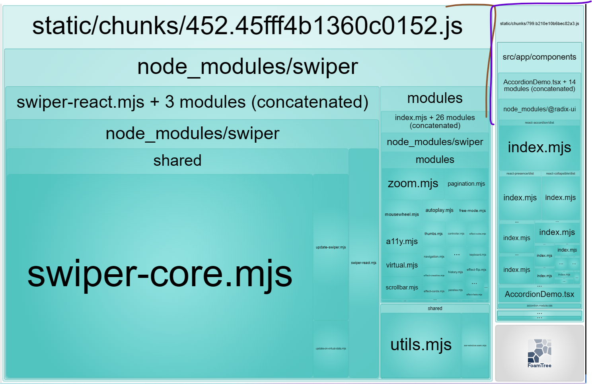
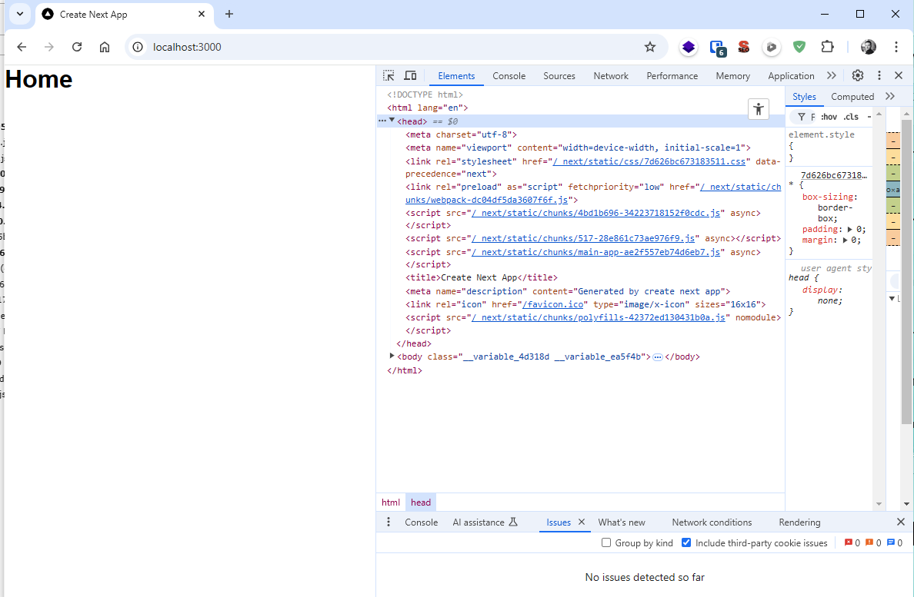

# Using `use client` directive in `src/app/componentMap.tsx`

## YES we have seperate js chunks :

## But the components are not displayed

See another use case: in the branch [feature/client-page](https://github.com/dia-loghmari/next-issue-demo/tree/feature/client-page)