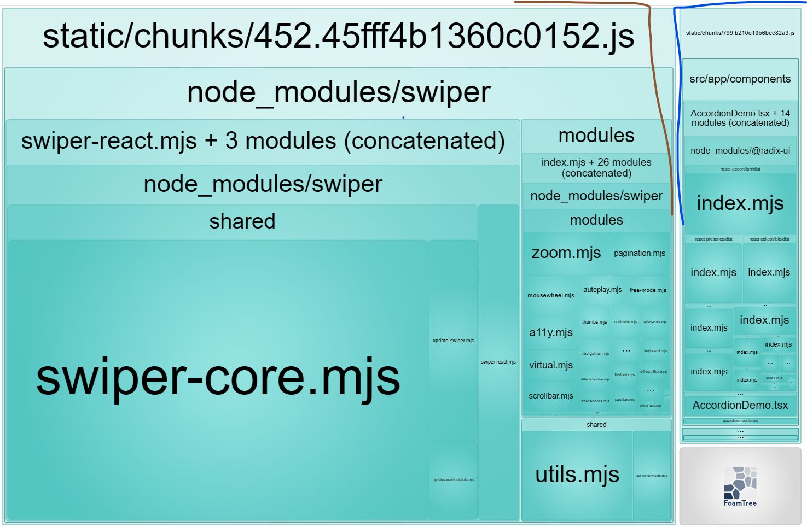
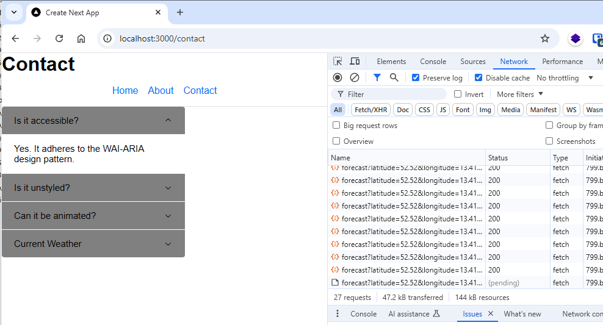

# Using `use client` directive in `src/app/[[...slug]]/page.tsx`

## YES we have seperate js chunks :

## But we have network waterfall

See another use case: in the branch [feature/client-component-map](https://github.com/dia-loghmari/next-issue-demo/tree/feature/client-component-map)